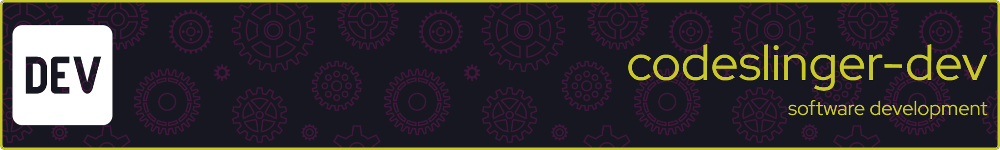

  

### My name is Jason [`codeslinger-dev`] and I write (and write about) code and the software development process.

### I am US-based, hold an undergraduate degree in Computer Science, and have made software development my career for the past 20+ years.  My primary language of choice is `C` (usually `C99`) for use in real-time, embedded applications. I also have extensive experience with C++, Make, Bash, Gitlab, Linux/Windows, as well as many other languages, tool, and environments.  I am currently learning Python, Rust and Zig.

### My non-professional software focus is on small, performant, cross-platform libraries and utilities.

<!--
**codeslinger-dev/codeslinger-dev** is a ✨ _special_ ✨ repository because its `README.md` (this file) appears on your GitHub profile.

Here are some ideas to get you started:

- 🔭 I’m currently working on ...
- 🌱 I’m currently learning ...
- 👯 I’m looking to collaborate on ...
- 🤔 I’m looking for help with ...
- 💬 Ask me about ...
- 📫 How to reach me: ...
- 😄 Pronouns: ...
- ⚡ Fun fact: ...
-->
