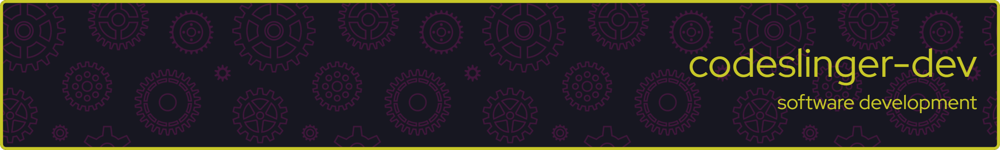

<!--
        Github README.md for:   codeslinger-dev / codeslinger-dev

        Header Image Source:    https://leviarista.github.io/github-profile-header-generator/

        Image Details:          width           :    2000
                                height          :     300
                                padding         :      40
                                bg color        : #171721

                                title color     : #c8c828
                                title font      : Red Hat Display
                                title size      :      80

                                subtitle size   :      40
                                subtitle color  : #c8c828
                                subtitle font   : Red Hat Display

                                border color    : #c8c828
                                border pix      :       6
                                border radius   :      12

                                pattern color   : #41173c
                                pattern size    :     500
                                pattern opacity :       1
-->

  

&nbsp;

## About me
### My name is Jason [`codeslinger-dev`] and I write (and write about) code and the software development process.

&nbsp;
### I am US-based, hold an undergraduate degree in Computer Science, and have made software development my career for the past 20+ years.  My primary language of choice is `C` (usually `C99`) for use in real-time, embedded applications. I also have extensive experience with C++, Make, Bash, Gitlab, Linux/Windows, as well as many other languages, tool, and environments.  I am currently learning Python, Rust and Zig.

&nbsp;

## Tools & Environments

&nbsp;

## Personal projects

### My non-professional software focus is on small, performant, cross-platform libraries and utilities.

### I strive to make simple tools and code libraries that allow new developers to 'hit the ground running' with easy-to-use mechanics that stay out of the way, allowing the user to focus on solving thier issues, rather than wrestling with bulky APIs and buggy structures.

&nbsp;

    

<!-- Badges: 

    

 

    

 

    

 

-->